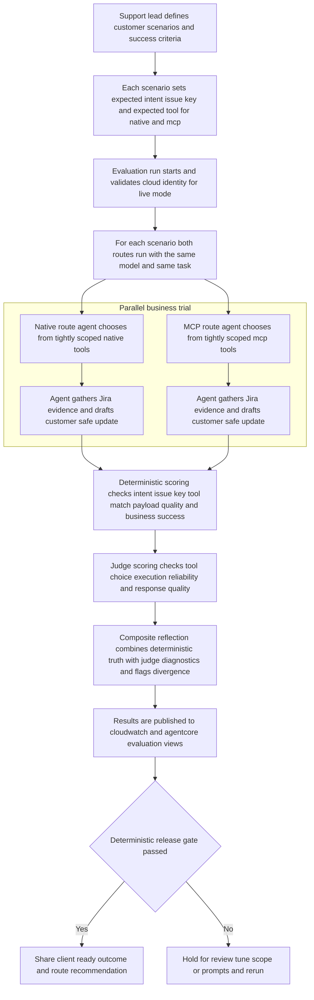

# Flutter AgentCore SOP PoC

## Overview
This repository validates whether an agent completes Jira-oriented support workflows more reliably when using a tool interface style it is more likely to be trained on.

It compares two fully agentic routes, both using the same model:
- `native`: agent selects and executes scoped Jira API-style tools.
- `mcp`: agent selects and executes scoped tools through AgentCore Gateway MCP.

Validation focus:
- route reliability and success outcomes (`tool_failure_rate`, `business_success_rate`)
- tool-selection correctness (`tool_match_rate`) against per-case expected tools
- latency impact
- deterministic release truth vs LLM-as-judge diagnostics (`composite_reflection` and divergence signal)

Alignment with Flutter architecture design:
- parity of agent behavior across routes (same model, same task, different tool interface)
- intent-scoped tool catalogs to reduce context bloat in both routes
- deterministic KPI gates as release truth with platform-visible diagnostics (CloudWatch + AgentCore surfaces)
- explicit failure taxonomy for operational review

### Business flow


## Setup
Prerequisites:
- Python 3.12+
- Node.js + npm
- AWS CLI with a configured named profile

Environment setup:
- use [.envrc.example](./.envrc.example) as the template for local environment values
- run `direnv allow` if you use `direnv`

Bootstrap command (installs dependencies and runs synth):
```bash
./scripts/bootstrap-repo.sh
```

Infrastructure deployment:
```bash
./scripts/bootstrap-repo.sh --deploy-infra
```

Notes:
- live evals require `MCP_GATEWAY_URL` and `STATE_MACHINE_ARN`
- non-dry-run evals perform AWS identity preflight (`sts:GetCallerIdentity`)
- dataset rows must include `expected_tool.native` and `expected_tool.mcp`

## Commands / Actions
Bootstrap and infra:
- `./scripts/bootstrap-repo.sh`
- `./scripts/bootstrap-repo.sh --deploy-infra`
- `npm --prefix infra run cdk:diff`

Evaluations:
- Dry run: `python evals/run_eval.py --dataset evals/golden/sop_cases.jsonl --flow both --scope route --iterations 5 --run-id 20260227T220000Z --state-machine-arn "$STATE_MACHINE_ARN" --aws-region "$AWS_REGION" --dry-run`
- Live + CloudWatch: `python evals/run_eval.py --dataset evals/golden/sop_cases.jsonl --flow both --scope route --iterations 10 --run-id 20260227T220000Z --state-machine-arn "$STATE_MACHINE_ARN" --aws-region "$AWS_REGION" --publish-cloudwatch`
- Live + judge: append `--enable-judge`

Quality gates:
- Default (coverage + lint + synth): `bash scripts/run-ci-quality-gates.sh`
- Include mutation gate locally: `RUN_MUTATION_GATE=1 bash scripts/run-ci-quality-gates.sh`
- Tune mutation threshold: `MUTATION_SCORE_TARGET=80 RUN_MUTATION_GATE=1 bash scripts/run-ci-quality-gates.sh`
- Disable duplication signals temporarily: `RUN_DUPLICATION_SIGNALS=0 bash scripts/run-ci-quality-gates.sh`
- Tune duplication severity threshold: `DUPLICATION_SIGNAL_MIN_SEVERITY=high bash scripts/run-ci-quality-gates.sh`

Duplication signal profiles (recorded when quality gates run):
- `audit duplication`: full codebase duplication context (excluding standard build/cache paths).
- `code-only duplication`: excludes lockfiles and generated architecture HTML so trendlines focus on maintainable source modules.
- Artifact pointers are printed as:
  - `DUPLICATION_AUDIT_SUMMARY=<path>`
  - `DUPLICATION_CODE_ONLY_SUMMARY=<path>`

Dashboard:
- Create/update dashboard for a run: `./scripts/create-cloudwatch-dashboard.sh --run-id 20260227T220000Z --region "$AWS_REGION"`

AgentCore online eval config:
- `python scripts/configure-agentcore-online-eval.py --name flutter-sop-poc-online-eval --role-arn "<EVAL_EXECUTION_ROLE_ARN>" --log-group "/aws/bedrock-agentcore/runtimes/flutterSopPocRuntime" --service-name bedrock-agentcore --evaluator-id "<EVALUATOR_ID_1>" --evaluator-id "<EVALUATOR_ID_2>" --aws-region "$AWS_REGION"`

Direct runtime checks:
- Native dry-run: `python -m runtime.sop_agent.main --flow native --input-file samples/case_001.json --dry-run`
- MCP dry-run: `python -m runtime.sop_agent.main --flow mcp --input-file samples/case_001.json --dry-run`

Manual pipeline invocation:
- `aws stepfunctions start-execution --state-machine-arn "<STATE_MACHINE_ARN>" --input '{"flow":"mcp","request_text":"Need customer sentiment and status update for JRASERVER-79286 before escalation.","case_id":"manual_run_001","expected_tool":"jira_get_issue_status_snapshot"}'`

CloudWatch metric namespace:
- `FlutterAgentCorePoc/Evals` (dimensions: `RunId`, `Flow`, `Scope`, `Dataset`)
