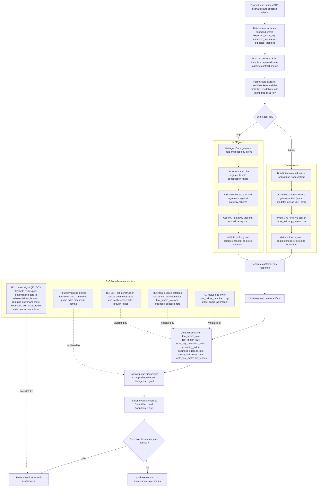

# Flutter AgentCore SOP PoC

## Installation

- Prerequisites: Python 3.12+, Node.js + npm, and AWS CLI with a configured named profile.
- Use [.envrc.example](./.envrc.example) as the local environment template and load it via your workflow tooling before running commands.
- Bootstrap and dependency setup is handled by `./scripts/bootstrap-repo.sh`; command matrix, deployment, benchmark, and troubleshooting steps are in [`AGENTS.md`](./AGENTS.md).

## Purpose

- This PoC compares native tool invocation and MCP call-construction paths under a shared model family, same contract set, and common KPI expectations.
- It is designed to produce deterministic release-truth metrics (`tool_failure_rate`, `business_success_rate`, latency, and token/cost deltas) while also surfacing MCP-specific construction diagnostics.
- The primary usage is to validate route parity decisions before promoting to full production flow design.

## Usage

- Prepare local configuration, bootstrap dependencies and infra, then run benchmark workflows against the deployed Step Functions state machine.
- Use the adversarial dataset to stress MCP call-construction and tool-selection edge cases while keeping the remaining pipeline contract stable.
- For troubleshooting and step-by-step action guidance, refer to [`AGENTS.md`](./AGENTS.md), which is the single source of developer command actions.

## Business flow

## References

- Reference artifacts and architecture assessments: `docs/references/bid-companion-2026-03-01/`
- Generated eval outputs: `reports/runs/<RUN_ID>/...`
- Test quality checklist for test-harness debt and complexity guardrails: `docs/test-quality-checklist.md`
