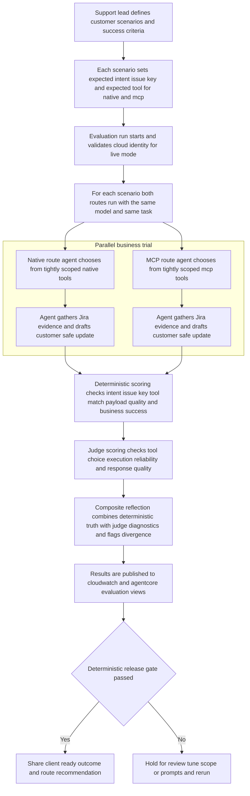

# Flutter AgentCore SOP PoC

This repository contains a proof-of-concept that compares two agentic orchestration paths for the same Jira-backed support SOP:

- `native`: agent selects and executes Jira API-style tools (native SDK/REST tropes).
- `mcp`: agent selects and executes tools through AgentCore Gateway MCP.

It also includes AWS CDK infrastructure for:

- AgentCore Runtime (code deployment)
- AgentCore Gateway with Jira tool target
- Step Functions automation pipeline with scheduled execution

## Business journey flow

## Quick start

1. Install Python dependencies:
   - `python3 -m pip install -r requirements.txt`
2. Install infra dependencies:
   - `cd infra && npm install`
3. Load project AWS context:
   - start from `.envrc.example` for local environment values
   - `direnv allow` (uses `.envrc` with sandbox profile + Bedrock inference profile)
   - ensure `MCP_GATEWAY_URL` and `STATE_MACHINE_ARN` are set for live runs
4. Run synthesis:
   - `cd infra && npm run cdk:synth`
5. Run a dry-run evaluation through the deployed Step Functions pipeline:
   - `python3 evals/run_eval.py --dataset evals/golden/sop_cases.jsonl --flow both --scope route --iterations 5 --run-id 20260227T220000Z --state-machine-arn "$STATE_MACHINE_ARN" --aws-region "$AWS_REGION" --dry-run`
6. Run statistically meaningful live route evaluation and publish deterministic + judge/composite metrics to CloudWatch:
   - `python3 evals/run_eval.py --dataset evals/golden/sop_cases.jsonl --flow both --scope route --iterations 10 --run-id 20260227T220000Z --state-machine-arn "$STATE_MACHINE_ARN" --aws-region "$AWS_REGION" --publish-cloudwatch`
7. Include LLM-as-judge diagnostics in the same run:
   - add `--enable-judge` (defaults to `BEDROCK_MODEL_ID`, typically `eu.amazon.nova-lite-v1:0`).
8. Create/update a CloudWatch dashboard for one run:
   - `./scripts/create-cloudwatch-dashboard.sh --run-id 20260227T220000Z --region "$AWS_REGION"`

## AgentCore online evaluations setup

Create or update an AgentCore online evaluation config:

- `python3 scripts/configure-agentcore-online-eval.py --name flutter-sop-poc-online-eval --role-arn "<EVAL_EXECUTION_ROLE_ARN>" --log-group "/aws/bedrock-agentcore/runtimes/flutterSopPocRuntime" --service-name bedrock-agentcore --evaluator-id "<EVALUATOR_ID_1>" --evaluator-id "<EVALUATOR_ID_2>" --aws-region "$AWS_REGION"`

## Direct runtime usage

- Native flow:
  - `python3 -m runtime.sop_agent.main --flow native --input-file samples/case_001.json --dry-run`
- MCP flow:
  - `python3 -m runtime.sop_agent.main --flow mcp --input-file samples/case_001.json --dry-run`

## Notes

- The dataset uses publicly accessible Jira issues from `jira.atlassian.com`.
- Each dataset row must include `expected_tool` with per-flow values: `{"native":"...","mcp":"..."}`.
- Non-dry-run mode requires Bedrock inference profile access for agent tool selection and generation (`eu.amazon.nova-lite-v1:0` by default).
- Non-dry-run mode performs an AWS auth preflight via `sts:GetCallerIdentity` before running evaluations.
- Both routes use the same model by default via `BEDROCK_MODEL_ID` (`eu.amazon.nova-lite-v1:0` unless overridden).
- MCP route uses intent-scoped tool bindings before selection to reduce catalog/context bloat.
- MCP flow requires a reachable, deployed AgentCore Gateway URL in `MCP_GATEWAY_URL`.
- If `--output` is omitted, eval results are written to `reports/runs/<RUN_ID>/eval/eval-<flow>-<scope>.json`.
- If `--publish-cloudwatch` is enabled, deterministic, judge, and composite reflection metrics are emitted to CloudWatch namespace `FlutterAgentCorePoc/Evals` (or `--cloudwatch-namespace` override).
- Dashboard script uses the same dimensions (`RunId`, `Flow`, `Scope`, `Dataset`) and lays out native-vs-MCP reliability, judge diagnostics, and composite reflection in one view.
- If `--enable-judge` is enabled, per-case LLM-as-judge scores are added plus `composite_reflection` (deterministic gate + judge diagnostic + divergence flag).
- Deterministic summary now includes `tool_match_rate` against per-case expected tools.
- Eval output includes `failure_reasons`; payload-shape failures now appear as `mcp_missing_issue_payload` (runtime) or `mcp_gateway_missing_issue_payload` (Lambda pipeline stage).
