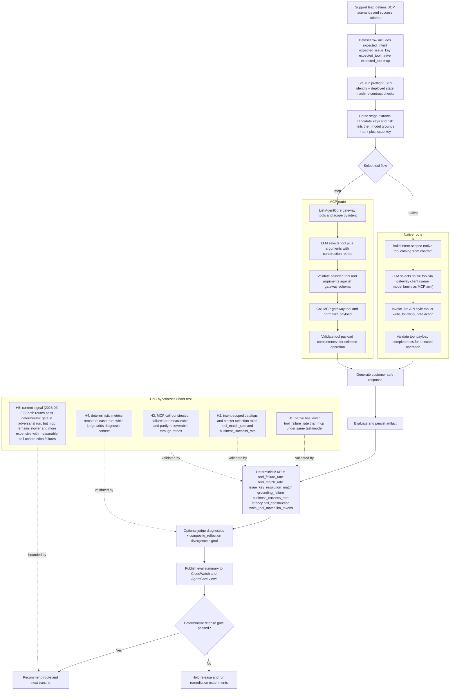

# Flutter AgentCore SOP PoC

## Overview
This repository validates whether an agent completes Jira-oriented support workflows more reliably when using a tool interface style it is more likely to be trained on.

It compares two fully agentic routes, both using the same model:
- `native`: agent selects and executes scoped Jira API-style tools.
- `mcp`: agent selects and executes scoped tools through AgentCore Gateway MCP.

Validation focus:
- route reliability and success outcomes (`tool_failure_rate`, `business_success_rate`)
- tool-selection correctness (`tool_match_rate`) against per-case expected tools
- latency impact
- deterministic release truth vs LLM-as-judge diagnostics (`composite_reflection` and divergence signal)

Alignment slice with Flutter architecture design (as of 2026-03-02, not full conformance):
- parity of agent behavior across routes (same model, same task, different tool interface)
- intent-scoped tool catalogs to reduce context bloat in both routes
- deterministic KPI gates as release truth with platform-visible diagnostics (CloudWatch + AgentCore surfaces)
- explicit failure taxonomy for operational review

Out of scope / not yet represented in this PoC:
- non-bypass L3 LiteLLM gateway service boundary with centralized quota/cache/circuit-breaker controls
- full L2 data-and-knowledge path (RAG/vector ingestion and retrieval services)
- R2/R3 workflow-contract semantics (HITL, compensation, fail-closed/write-ahead immutable audit behavior)

### Hypothesis under test
- Primary hypothesis: MCP route reliability is lower than native route reliability when the model must construct MCP tool-call arguments (schema-sensitive, model-driven call construction).
- Secondary hypothesis: Flutter-style intent scoping reduces context bloat, but does not fully remove MCP-specific call-construction failure risk.
- Cost hypothesis: MCP route consumes more tokens and latency due to larger tool descriptors, additional call-construction reasoning, and retries after schema validation failures.

### Known MCP risk factors this PoC targets
- Context bloat risk: tool descriptions + schemas increase prompt surface and distract selection.
- Call-construction fragility: model must produce exact argument JSON for each tool schema (`issue_key`, `note_text`, types, unknown-arg exclusion).
- Wrapper variance risk: prefixed tool names and server-specific conventions are less standardized than provider-native tool APIs.
- Retry masking risk: retries can recover failures, but inflate latency/tokens and hide first-pass reliability gaps.
- Multi-step protocol risk: tool listing, selection, argument construction, call, and payload normalization each add failure surface.

### Why 95 percent per step is not enough
- End-to-end success compounds across stages.
- If `p_intent = p_tool_select = p_call_construct = p_tool_execute = p_validate = 0.95`, then `p_success = 0.95^5 = 77.4%`.
- If only call construction drops to `0.85`, with others at `0.95`, then `p_success = 0.95^4 * 0.85 = 69.3%`.
- Two-attempt retry can raise construction success (`1 - (1 - p)^2`) but increases token and latency cost; with correlated errors, real recovery is lower than this optimistic bound.

### How this PoC tests those risks
- Controlled parity: same case, same model family, shared model-driven grounding path, different tool interface route (`native` vs `mcp`).
- Grounding is no longer deterministic first-key extraction; parse stage resolves `intent + issue_key` from candidate keys with schema-constrained retries.
- Deterministic KPIs: `tool_failure_rate`, `tool_match_rate`, `business_success_rate`, `call_construction_*`, `write_tool_match_rate`, `llm_*_tokens`, and `estimated_cost_usd`.
- Attribution KPIs: `issue_key_resolution_match_rate`, `grounding_failure_rate`, `mean_grounding_retries`, plus MCP `call_construction_error_taxonomy`.
- Cost observability: token totals/means per flow, per intent, and per adversarial vector, plus estimated USD cost from a versioned model pricing catalog snapshot embedded in each run artifact.
- Failure taxonomy: explicit reasons for selection mismatch, construction retry exhaustion, tool-call failure, and payload completeness failure.
- Adversarial stress suite: additional dataset specifically designed to provoke model-driven MCP call-construction errors.

### Adversarial dataset
- File: [evals/golden/sop_cases_adversarial.jsonl](./evals/golden/sop_cases_adversarial.jsonl)
- Goal: stress point 1 directly (model-driven MCP call construction fragility) while keeping native route deterministic after selection.
- Stress vectors included:
- `dual_issue_key_*`: first-key extraction vs second-key bait in natural language and JSON snippets.
- `second_key_target_*`: explicit tests where the correct key is not the first mention, to validate model-driven grounding behavior.
- `*_wrong_argument_names`: bait with `issueKey`/`note` style fields that conflict with required schema (`issue_key`/`note_text`).
- `schema_pollution_unknown_args`: instructions that encourage extra unsupported args.
- `*_tool_bait`: prompt content that names incorrect tools to trigger selection/call drift.
- `write_note_*`: punctuation-heavy, quoted, and structured follow-up-note text to stress write-call argument construction.
- Expected outcome pattern:
- Native and MCP may still align on many selections, but MCP should show higher construction pressure through `call_construction_attempts`, retries/failures, and higher `llm_total_tokens`.

### Business flow and hypotheses (current as of 2026-03-02)


### Latest benchmark snapshot (as of 2026-03-02)

Source artifact:
- `reports/runs/nova-adv-large-postfix-20260302T214400Z/eval/eval-both-route.json`

Conditions:
- dataset: `evals/golden/sop_cases_adversarial.jsonl`
- iterations: `4`
- model parity: gateway `eu.amazon.nova-lite-v1:0`, runtime `eu.amazon.nova-lite-v1:0`
- provider: `bedrock`

Key route metrics:

| Flow | Cases | Tool Failure Rate | Tool Match Rate | Business Success Rate | Mean Latency (ms) | Mean LLM Total Tokens | Mean Estimated Cost (USD) | Deterministic Release Score |
|---|---:|---:|---:|---:|---:|---:|---:|---:|
| native | 112 | 0.0000 | 0.9643 | 0.8571 | 1639.62 | 650.89 | 0.00007385 | 0.9125 |
| mcp | 112 | 0.0714 | 0.8929 | 0.8214 | 2167.28 | 1040.84 | 0.00010860 | 0.8911 |

Observed deltas (`mcp - native`):
- `tool_failure_delta`: `+0.0714`
- `latency_delta_ms`: `+527.66`
- `call_construction_failure_delta`: `+0.0893`
- `selection_divergence_rate`: `0.1071` (12 / 112)
- `mean_llm_total_tokens_delta`: `+389.05`
- `mean_estimated_cost_usd_delta`: `+0.00003475`

Dominant MCP failure reasons in the latest run:
- `selected_unknown_tool:jira_write_issue_followup_note` (4)
- `selected_unknown_tool:jira-issue-tools___jira_create_comment` (4)

## Setup
Prerequisites:
- Python 3.12+
- Node.js + npm
- AWS CLI with a configured named profile

Environment setup:
- use [.envrc.example](./.envrc.example) as the template for local environment values
- run `direnv allow` if you use `direnv`

Bootstrap command (installs dependencies and runs synth):
```bash
./scripts/bootstrap-repo.sh
```

Infrastructure deployment:
```bash
./scripts/bootstrap-repo.sh --deploy-infra
```

Notes:
- live evals through Step Functions require `STATE_MACHINE_ARN`
- direct runtime MCP checks require `MCP_GATEWAY_URL`
- non-dry-run evals perform AWS identity preflight (`sts:GetCallerIdentity`)
- dataset rows must include `expected_tool.native` and `expected_tool.mcp`
- runtime execution input must include `expected_tool` for each case (manual or scheduled)
- eval runner validates artifact schema per flow and fails fast on drift (`artifact_schema_invalid:*`)
- lambda model calls route through `llm_gateway_client` with `MODEL_ID` and provider mode `MODEL_PROVIDER=auto|bedrock|openai`
- AgentCore runtime model calls also route through the LLM gateway and read `MODEL_ID` + `MODEL_PROVIDER`
- CDK region guard: deployments outside `eu-west-1` require explicit `MODEL_ID`
- PoC lifecycle guard: `EPHEMERAL_STACK=false` retains logs and artifacts; set `EPHEMERAL_STACK=true` for disposable stacks
- for OpenAI models in deployed lambdas, set `OPENAI_API_KEY_SECRET_ARN` (Secrets Manager) and redeploy infra
- OpenAI runtime options default to `OPENAI_REASONING_EFFORT=medium`, `OPENAI_TEXT_VERBOSITY=medium`, and `OPENAI_MAX_OUTPUT_TOKENS=2000` (or override with eval CLI flags)
- eval pricing catalog default: `evals/model_pricing_usd_per_1m_tokens.json`; every run records `model_pricing_snapshot` (catalog path/version/hash, model id, and input/output USD per 1M token rates)
- pricing resolution supports reasoning-tier keys with format `<model_id>:reasoning-<low|medium|high>` (used when present; otherwise falls back to `<model_id>`)
- judge mode is Bedrock-only; set `BEDROCK_JUDGE_MODEL_ID` to a Bedrock model ID/ARN when using `--enable-judge`

Reference reports:
- bid companion and assessment artifacts live in `docs/references/bid-companion-2026-03-01/`
- generated eval outputs remain under `reports/runs/<RUN_ID>/...`

## Commands / Actions
Bootstrap and infra:
- `./scripts/bootstrap-repo.sh`
- `./scripts/bootstrap-repo.sh --deploy-infra`
- `npm --prefix infra run cdk:diff`

Evaluations:
- Dry run: `python evals/run_eval.py --dataset evals/golden/sop_cases.jsonl --flow both --scope route --iterations 5 --run-id 20260227T220000Z --state-machine-arn "$STATE_MACHINE_ARN" --aws-region "$AWS_REGION" --dry-run`
- Live + CloudWatch: `python evals/run_eval.py --dataset evals/golden/sop_cases.jsonl --flow both --scope route --iterations 10 --run-id 20260227T220000Z --state-machine-arn "$STATE_MACHINE_ARN" --aws-region "$AWS_REGION" --publish-cloudwatch`
- Live + judge: append `--enable-judge`
- Adversarial run (point-1 stress): `python evals/run_eval.py --dataset evals/golden/sop_cases_adversarial.jsonl --flow both --scope route --iterations 1 --run-id 20260302T220000Z --state-machine-arn "$STATE_MACHINE_ARN" --aws-region "$AWS_REGION"`
- Adversarial run with CloudWatch: append `--publish-cloudwatch`
- Model override for controlled comparisons: append `--model-id "<MODEL_ID>" --bedrock-region "$AWS_REGION"`
- Provider override for controlled comparisons: append `--model-provider auto|bedrock|openai`
- OpenAI option override: append `--openai-reasoning-effort <low|medium|high> --openai-text-verbosity <low|medium|high> --openai-max-output-tokens <int>`
- Pricing override for a run (optional): append `--price-input-per-1m-tokens-usd <float> --price-output-per-1m-tokens-usd <float>`

Quality gates:
- Default (prettier + eslint + ruff + lizard + coverage + lint + synth): `bash scripts/run-ci-quality-gates.sh`
- Include mutation gate locally: `RUN_MUTATION_GATE=1 bash scripts/run-ci-quality-gates.sh`
- Tune mutation threshold: `MUTATION_SCORE_TARGET=80 RUN_MUTATION_GATE=1 bash scripts/run-ci-quality-gates.sh`
- Tune complexity threshold (eslint/ruff/lizard): `COMPLEXITY_MAX=10 bash scripts/run-ci-quality-gates.sh`
- Disable duplication signals temporarily: `RUN_DUPLICATION_SIGNALS=0 bash scripts/run-ci-quality-gates.sh`
- Tune duplication severity threshold: `DUPLICATION_SIGNAL_MIN_SEVERITY=high bash scripts/run-ci-quality-gates.sh`

Duplication signal profiles (recorded when quality gates run):
- `audit duplication`: full codebase duplication context (excluding standard build/cache paths).
- `code-only duplication`: excludes lockfiles and generated architecture HTML so trendlines focus on maintainable source modules.
- Artifact pointers are printed as:
  - `DUPLICATION_AUDIT_SUMMARY=<path>`
  - `DUPLICATION_CODE_ONLY_SUMMARY=<path>`

Dashboard:
- Create/update dashboard for a run: `./scripts/create-cloudwatch-dashboard.sh --run-id 20260227T220000Z --region "$AWS_REGION"`

AgentCore online eval config:
- `python scripts/configure-agentcore-online-eval.py --name flutter-sop-poc-online-eval --role-arn "<EVAL_EXECUTION_ROLE_ARN>" --log-group "/aws/bedrock-agentcore/runtimes/flutterSopPocRuntime" --service-name bedrock-agentcore --evaluator-id "<EVALUATOR_ID_1>" --evaluator-id "<EVALUATOR_ID_2>" --aws-region "$AWS_REGION"`

Direct runtime checks:
- Native dry-run: `python -m runtime.sop_agent.main --flow native --input-file samples/case_001.json --dry-run`
- MCP dry-run: `python -m runtime.sop_agent.main --flow mcp --input-file samples/case_001.json --dry-run`

Manual pipeline invocation:
- `aws stepfunctions start-execution --state-machine-arn "<STATE_MACHINE_ARN>" --input '{"flow":"mcp","request_text":"Need customer sentiment and status update for JRASERVER-79286 before escalation.","case_id":"manual_run_001","expected_tool":"jira_get_issue_status_snapshot"}'`

CloudWatch metric namespace:
- `FlutterAgentCorePoc/Evals` (dimensions: `RunId`, `Flow`, `Scope`, `Dataset`)
