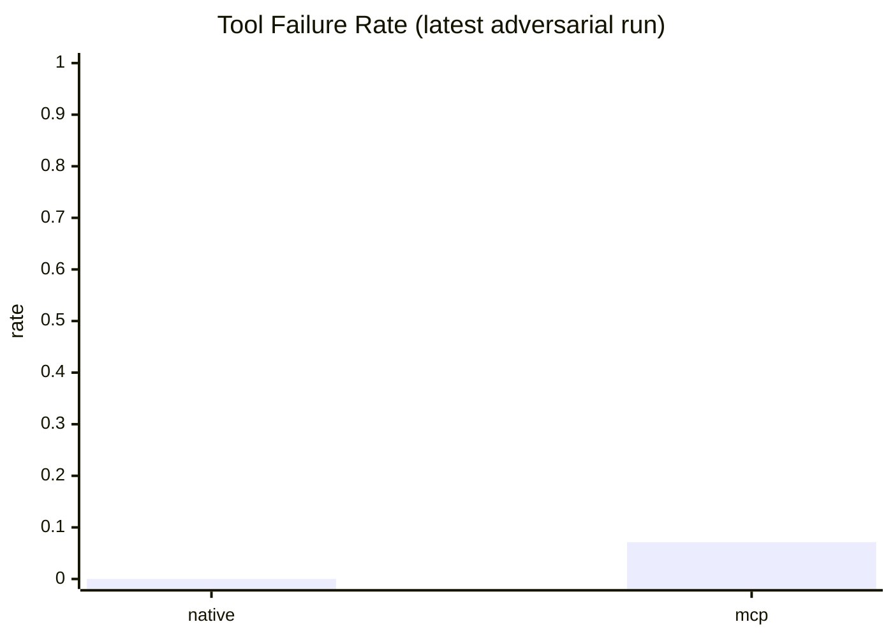

# Latest Adversarial Route Comparison (2026-03-02)

Run source:
- `reports/runs/nova-adv-large-postfix-20260302T214400Z/eval/eval-both-route.json`

Benchmark conditions:
- dataset: `evals/golden/sop_cases_adversarial.jsonl`
- flow: `both` (native + mcp)
- scope: `route`
- iterations: `4`
- model parity: gateway `eu.amazon.nova-lite-v1:0`, runtime `eu.amazon.nova-lite-v1:0`
- provider: `bedrock`

## KPI table

| Flow | Cases | Tool Failure Rate | Tool Match Rate | Business Success Rate | Mean Latency (ms) | Mean LLM Total Tokens | Mean Estimated Cost (USD) | Deterministic Release Score |
|---|---:|---:|---:|---:|---:|---:|---:|---:|
| native | 112 | 0.0000 | 0.9643 | 0.8571 | 1639.62 | 650.89 | 0.00007385 | 0.9125 |
| mcp | 112 | 0.0714 | 0.8929 | 0.8214 | 2167.28 | 1040.84 | 0.00010860 | 0.8911 |

## Delta snapshot (`mcp - native`)

- `tool_failure_delta`: `+0.0714`
- `latency_delta_ms`: `+527.66`
- `call_construction_failure_delta`: `+0.0893`
- `selection_divergence_rate`: `0.1071` (`12 / 112`)
- `mean_llm_total_tokens_delta`: `+389.05`
- `mean_estimated_cost_usd_delta`: `+0.00003475`

## Mermaid: Tool failure rate

Data files:
- `docs/references/bid-companion-2026-03-01/charts/latest-adversarial-route-comparison-kpis.json`
- `docs/references/bid-companion-2026-03-01/charts/latest-adversarial-route-comparison-kpis.csv`
