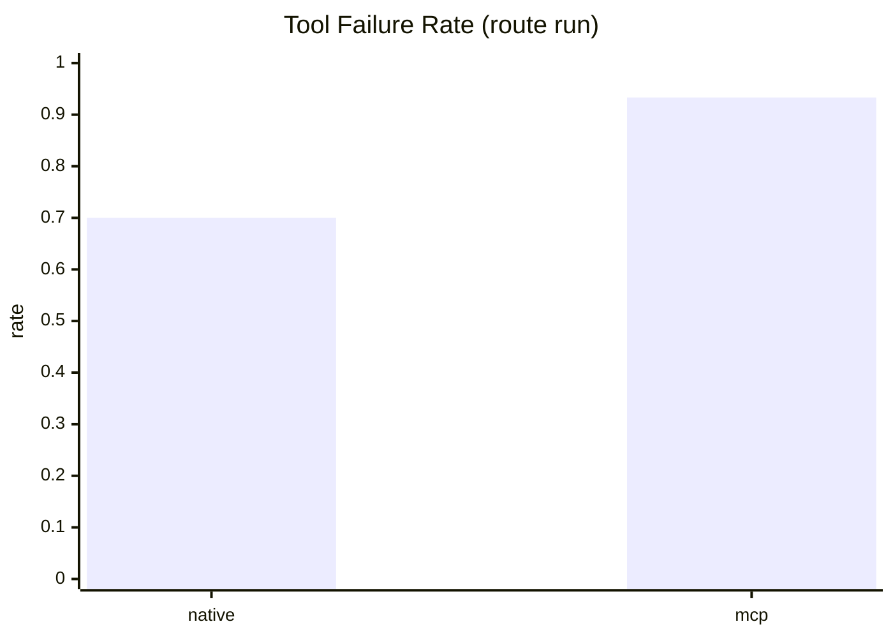
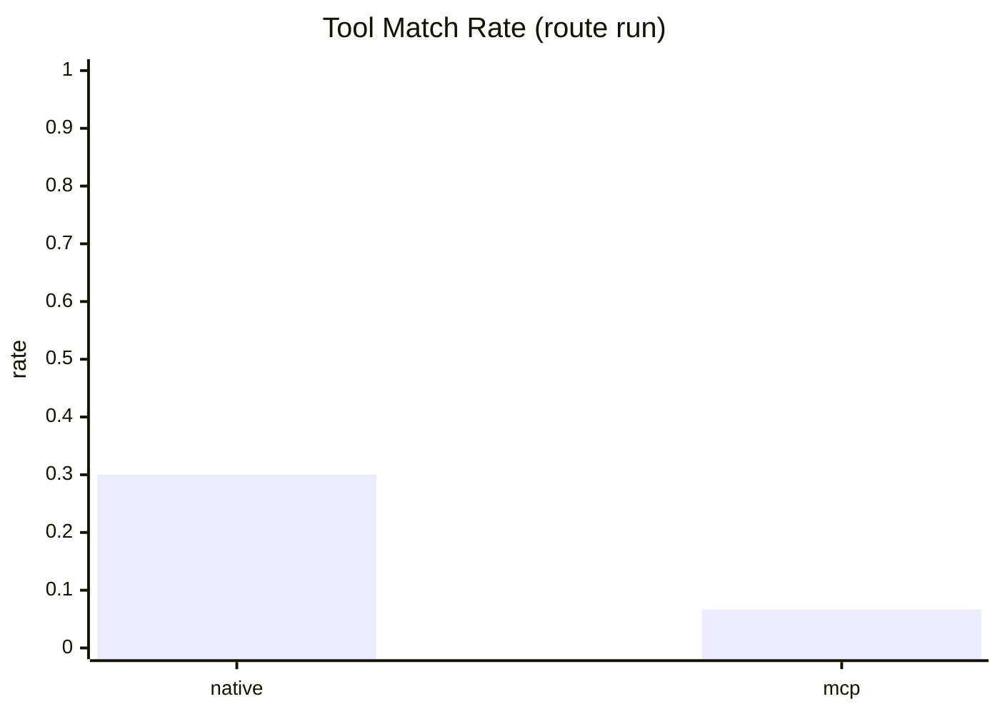

# Post-Deploy Comparison Charts (2026-03-01)

Run sources:
- Route: `reports/runs/postdeploy-route-20260301T200250Z/eval/eval-both-route.json`
- Full: `reports/runs/postdeploy-full-20260301T200729Z/eval/eval-both-full.json`

## KPI Table

| Scope | Flow | Cases | Tool Failure Rate | Tool Match Rate | Business Success Rate | Mean Latency (ms) |
|---|---:|---:|---:|---:|---:|---:|
| route | native | 30 | 0.7000 | 0.3000 | 0.2000 | 1652.77 |
| route | mcp | 30 | 0.9333 | 0.0667 | 0.0667 | 1960.65 |
| full | native | 10 | 0.7000 | 0.3000 | 0.2000 | 1630.94 |
| full | mcp | 10 | 0.9000 | 0.1000 | 0.1000 | 1923.11 |

## Mermaid: Tool Failure Rate (Route)

## Mermaid: Tool Match Rate (Route)

## Delta Snapshot

- Route `tool_failure_delta` (mcp - native): 0.2333
- Route `latency_delta_ms` (mcp - native): 307.88
- Full `tool_failure_delta` (mcp - native): 0.2000
- Full `latency_delta_ms` (mcp - native): 292.17

Chart data files:
- `docs/references/bid-companion-2026-03-01/charts/postdeploy-comparison-kpis.json`
- `docs/references/bid-companion-2026-03-01/charts/postdeploy-comparison-kpis.csv`
