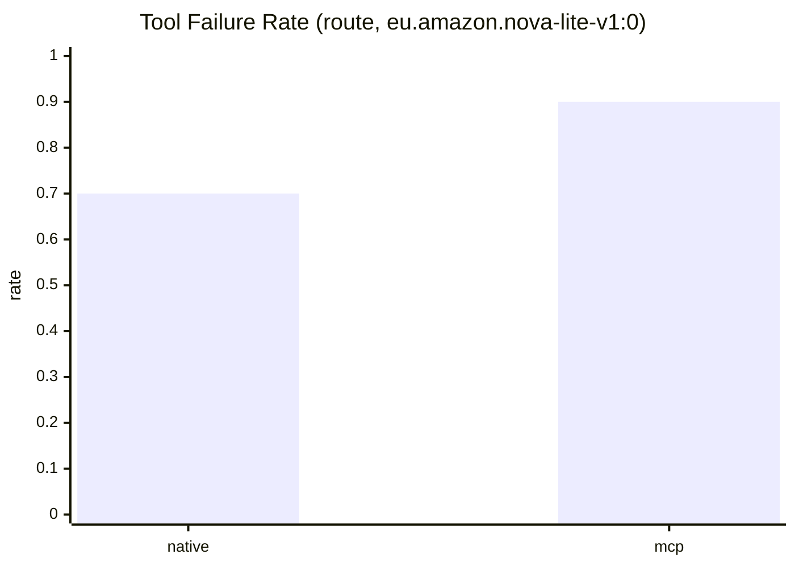

# Three-Model Route Benchmark (2026-03-01)

## Benchmark Conditions

- Dataset: `evals/golden/sop_cases.jsonl`
- Flow: `both` (native + mcp)
- Scope: `route`
- Iterations: `3`
- AWS region: `eu-west-1`
- State machine: `arn:aws:states:eu-west-1:530267068969:stateMachine:SopAutomationPipelineF2E8B14A-9Q34zedvCDIs`

## Model Run Status

| Model | Model ID | Status | Run ID | Notes |
|---|---|---|---|---|
| Bedrock Default | `eu.amazon.nova-lite-v1:0` | completed | `bench3model-nova-route-20260301T203500Z` | Produced full route KPI payload |
| GPT-5 | `gpt-5` | failed | `bench3model-gpt5-route-20260301T204100Z` | `ValidationException`: provided model identifier is invalid |
| GPT-5 Codex High | `gpt-5-codex-high` | failed | `bench3model-gpt5codexhigh-route-20260301T204130Z` | `ValidationException`: provided model identifier is invalid |

## Completed KPI Table (Bedrock Default)

| Flow | Cases | Tool Failure Rate | Tool Match Rate | Business Success Rate | Mean Latency (ms) |
|---|---:|---:|---:|---:|---:|
| native | 30 | 0.7000 | 0.3000 | 0.2000 | 1599.44 |
| mcp | 30 | 0.9000 | 0.1000 | 0.1000 | 1964.37 |

## Delta Snapshot (mcp - native)

- `tool_failure_delta`: `+0.2000`
- `latency_delta_ms`: `+364.93`
- `deterministic_release_score_delta`: `-0.1050`

## Availability Probe Notes

- Bedrock model probe in `eu-west-1` returned no model IDs matching GPT-5 or Codex naming.
- Available OpenAI-branded Bedrock models are GPT-OSS variants (`openai.gpt-oss-*`), not GPT-5/Codex High.

## Mermaid: Tool Failure Rate (completed model)

Data files:
- `docs/references/bid-companion-2026-03-01/charts/three-model-route-comparison-kpis.json`
- `docs/references/bid-companion-2026-03-01/charts/three-model-route-comparison-kpis.csv`
